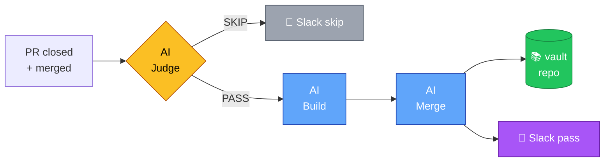
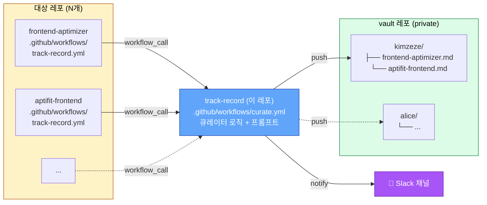
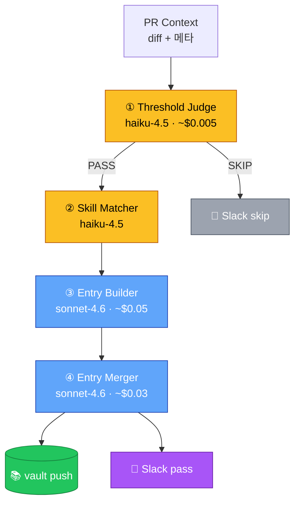

# Track Record

PR이 머지되는 순간 AI가 변경 사항을 분석해 **이력서감인지 자율 판단**하고, 통과한 작업만 별도 vault 레포에 **4문장 STAR 형식**으로 자동 적립하는 reusable GitHub Action.



> **새 레포에 적용하려면?** [`docs/SETUP_GUIDE.md`](docs/SETUP_GUIDE.md)를 참고하세요. AI 어시스턴트에게 이 파일을 제공하면 셋업을 도와줍니다.
>
> **프롬프트 추가·수정하려면?** [`docs/PROMPT_GUIDE.md`](docs/PROMPT_GUIDE.md)를 참고하세요.

---

## 목차

- [왜 만들었나](#왜-만들었나)
- [어떻게 동작하나](#어떻게-동작하나)
- [아키텍처](#아키텍처)
- [큐레이터 4단계 파이프라인](#큐레이터-4단계-파이프라인)
- [4문장 STAR 형식](#4문장-star-형식)
- [프롬프트 시스템](#프롬프트-시스템)
- [출력 예시](#출력-예시)
- [Slack 알림](#slack-알림)
- [빠른 시작 가이드](#빠른-시작-가이드)
- [설정 옵션](#설정-옵션)
- [비용 추정](#비용-추정)
- [프로젝트 구조](#프로젝트-구조)
- [개발 가이드](#개발-가이드)
- [새 레포에 적용하기](#새-레포에-적용하기)
- [트러블슈팅](#트러블슈팅)

---

## 왜 만들었나

이력서를 쓸 때 가장 어려운 건 "내가 1년 전에 뭐 했는지"가 흐려진다는 점입니다. PR 제목·diff는 GitHub에 살아 있지만 **"왜 그 결정을 내렸는지", "어떤 트레이드오프를 감수했는지"**, **"결과 수치가 어땠는지"** 같은 의사결정 흔적은 시간이 지나면 사라집니다.

요즘 좋은 이력서의 차별화 요소는 단순 "X를 했다"가 아니라 **서사**입니다 — 왜 시작했고, 어떤 대안을 고려했고, 어떻게 트레이드오프했고, 결과가 어땠는지. 그리고 이 서사야말로 AI가 쉽게 못 만드는 부분입니다.

Track Record는 **PR 머지 시점에 그 서사가 가장 fresh할 때 자동으로 포착해 응축형으로 적립**하는 시스템입니다.

- 사람은 평소처럼 코드 짜고 PR 머지만 합니다
- AI가 자율적으로 "이력서감"을 판단해 통과한 작업만 적립합니다
- 통과한 작업은 4문장 STAR 형식(문제 · 결정 · 결과 · 학습)으로 응축되어 vault에 누적됩니다
- 비슷한 주제는 자동으로 통합·보강합니다

### 참고한 것들

- [Senior Reviewer](https://github.com/aptimizer-co/senior-reviewer) — Caller-Executor 패턴 그대로 차용
- STAR 기법 — Situation·Task·Action·Result로 서사 구조화
- 4문장 응축 — 토큰 비용·가독성 트레이드오프 (8요소 풀버전 30~50줄 → 4문장 5~7줄, ~70% 절감)

---

## 어떻게 동작하나

```
1. 개발자가 PR을 머지한다 (보통 dev 브랜치로)
2. caller workflow가 트리거된다
3. reusable workflow가 PR diff·메타데이터를 수집한다
4. AI Judge가 임계 통과 여부를 1차 판정한다 (가벼운 모델)
   ├── PASS → 다음 단계
   └── SKIP → Slack 알림 후 종료 (비용 절감)
5. AI Skill Matcher가 변경 파일에서 베스트 프랙티스 매칭한다
6. AI Entry Builder가 4문장 STAR entry를 작성한다 (강한 모델)
7. AI Entry Merger가 기존 vault entry와 비교한다
   ├── 유사 주제 → 기존 블록 보강 (metric 통합)
   ├── 새 주제   → 새 블록 append
   └── 첫 엔트리 → fresh 작성
8. vault repo의 {username}/{project}.md 에 push한다
9. Slack 알림 전송 (PASS/SKIP 모두)
```

---

## 아키텍처

senior-reviewer의 **Caller-Executor 패턴**을 그대로 따랐습니다. 출력 대상이 PR 코멘트가 아닌 외부 vault 레포라는 점만 다릅니다.



**3 종류의 레포:**

| 레포 종류 | 역할 | 갯수 |
|---|---|---|
| **track-record** (이 레포) | 큐레이터 로직 + 워크플로우 보관 | 1개 (조직당) |
| **vault repo** | 적립된 entry 누적 저장 | 1개 (조직당, 보통 private) |
| **target repo** | 평소 코드 작업하는 곳 | N개 (각 레포에 caller 1줄) |

**중앙 관리의 장점:**
- 큐레이터 로직을 한 곳에서 관리 — 수정하면 모든 대상 레포에 즉시 반영
- 대상 레포는 caller workflow 하나만 추가하면 끝 (13줄 YAML)
- 프롬프트·모델 설정이 코드와 분리되어 독립적으로 개선 가능

---

## 큐레이터 4단계 파이프라인



### 단계별 책임

| 단계 | 역할 | 모델 | 출력 |
|------|------|------|------|
| **① Threshold Judge** | 이력서감 1차 판정 | haiku-4.5 (가벼움) | `{ pass, category, reason }` |
| **② Skill Matcher** | 베스트 프랙티스 스킬 매칭 | haiku-4.5 | `{ skills: [...] }` |
| **③ Entry Builder** | 4문장 STAR entry 작성 | sonnet-4.6 (강함) | `{ category, headline, metaLine, body }` |
| **④ Entry Merger** | 기존 vault md와 통합 판단 | sonnet-4.6 | `{ action, updatedMarkdown, reason }` |

### 임계 통과 기준

`prompts/curator/threshold-judge.md`가 다음 기준으로 PASS/SKIP을 결정:

- **테크 깊이** — 패턴·아키텍처·라이브러리의 깊이 있는 사용, 추상화 수준, 비자명한 트레이드오프 결정
- **임팩트** — 정량 수치(성능·번들·CI 시간 등), 사용자 영향, 버그 규모, 비용 절감

**둘 중 하나라도 강하면 PASS**, 둘 다 약하면 SKIP. 단순 dependency bump, lint·format·typo 수정, 빈 description은 자동 SKIP.

### 모델 계단으로 비용 절감

`Threshold Judge`(가장 자주 호출)에 가벼운 haiku를 두고, 통과한 PR만 sonnet으로 분석. 또한 **Anthropic prompt caching**을 system prompt + 베스트 프랙티스 .md에 적용해 입력 토큰을 ~90% 할인합니다.

---

## 4문장 STAR 형식

각 entry는 **4문장 응축형 + 메타 1줄**로 구성됩니다.

### 문장 매핑

| 문장 | 담는 내용 | 역할 |
|------|----------|------|
| **1. 문제** | 상황 + 부족함 (정량 가능 시) | 왜 시작했나 |
| **2. 결정** | 대안 + 트레이드오프 ("X 대신 Y") | 왜 그 선택? — 시니어리티 시그널 |
| **3. 결과** | 구현 핵심 + 정량 임팩트 | 어떻게 했고 어떤 수치 |
| **4. 학습** *(선택)* | 회고 / 한계 / 후속 | 회고·성장 시그널 |

### 길이 룰

- 최소 2문장 (문제 + 결과)
- 표준 3문장 (문제 + 결정 + 결과)
- 최대 4문장 (학습 추가)
- **절대 5문장 이상 금지**

### 추측 허용 범위

PR 메타·diff·commit message에 닿아 있는 합리적 추정은 OK. 무에서 만든 할루시네이션은 금지. 정량 수치는 PR/diff/commit에 명시된 것만 인용, 없으면 정성 서술로 대체.

### 메타 라인 포맷

```
[PR #N](url) · YYYY-MM-DD · `stack1` `stack2` `stack3`
```

---

## 프롬프트 시스템

system prompt는 **단계별 프롬프트 + 매칭된 스킬**을 동적으로 합성합니다. 이를 통해 한 시스템으로 다양한 기술 스택의 PR에 맞춤 entry를 생성합니다.

```
┌──────────────────────────────────────────────┐
│  Layer 1: Curator 프롬프트 (필수)              │  prompts/curator/{stage}.md
│  → 4단계 각 역할/룰 (범용)                     │  threshold-judge / skill-matcher
│                                                │  entry-builder / entry-merger
├──────────────────────────────────────────────┤
│  Layer 2: Stack 프롬프트 (선택, 복수)           │  prompts/stacks/{name}.md
│  → 매칭된 베스트 프랙티스 (Entry Builder만)     │  Skill Matcher가 동적 선택
└──────────────────────────────────────────────┘
```

### 사용 가능한 프롬프트

| 분류 | 파일 | 설명 |
|------|------|------|
| **Curator** | `curator/threshold-judge.md` | PASS/SKIP 판정 기준 |
| | `curator/skill-matcher.md` | 변경 파일 → 스킬 매칭 룰 |
| | `curator/entry-builder.md` | 4문장 STAR 작성 가이드 |
| | `curator/entry-merger.md` | 기존 entry와 통합 판단 |
| **Stack** | `stacks/vercel-react-best-practices.md` | React 컴포넌트·hook·렌더링 (시작 셋) |

### 새 베스트 프랙티스 추가

운영하면서 자주 등장하는 주제(예: TanStack Query, Next.js App Router 등)는 그때 추가:

1. `prompts/stacks/{name}.md` 생성 (구조: 핵심 원칙 / 안티패턴 / entry 작성 활용)
2. `prompts/curator/skill-matcher.md` 의 "사용 가능한 스킬"에 새 이름·매칭 시그널 추가
3. `pnpm test && pnpm build` 검증
4. main에 머지 → 모든 caller에 즉시 반영

자세한 내용은 [`docs/PROMPT_GUIDE.md`](docs/PROMPT_GUIDE.md).

---

## 출력 예시

### vault entry 예시

`aptimizer-co/track-record-vault/kimzeze/frontend-aptimizer.md`:

```markdown
# frontend-aptimizer

## Performance > Caching
### Turborepo Remote Cache로 CI 62% 단축
[PR #102](https://github.com/aptimizer-co/frontend-aptimizer/pull/102) · 2026-03-15 · `Turborepo` `GitHub Actions`

모노레포 18 패키지 규모에서 매 push마다 변경 없는 패키지까지 재빌드되며 CI 평균 8분 → 팀 throughput 병목.

Nx 마이그레이션은 도구 전환 비용이 크고 GitHub Actions cache는 task graph 단위 캐싱 미지원이라, 기존 turbo.json 자산 재사용 가능한 remote cache 채택.

도입 1주 측정 시 CI 8분 → 3분(62%↓), 캐시 히트율 73%, 팀 머지 throughput 주당 22 → 31건.

빌드 결정성(타임스탬프 제거)이 캐시 안정성의 선결조건임을 첫 주 무효화 사고로 학습.

## Performance > React Server Components
### App Router 마이그레이션으로 초기 번들 57% 감축
[PR #156](https://github.com/aptimizer-co/frontend-aptimizer/pull/156) · 2026-04-02 · `Next.js` `RSC`

(... 4문장 STAR ...)

## DX > Build Tooling
### ...
```

vault 폴더 구조:

```
{vault repo}/
├── README.md                      ← 자동 생성
├── kimzeze/
│   ├── README.md                  ← 사용자 인덱스 자동 생성
│   ├── frontend-aptimizer.md      ← 프로젝트별 entry 누적
│   └── aptifit-frontend.md
├── alice/
│   ├── README.md
│   └── frontend-aptimizer.md      ← 같은 프로젝트도 사람별 분리
└── bob/
    └── ...
```

**카테고리는 AI 동적 태깅** — 고정 목록 없이 PR 본질에 가장 가까운 단어로 자유롭게. 시간이 지나면 자연스럽게 분류가 진화합니다.

---

## Slack 알림

PASS/SKIP 모두 알림 전송 (webhook 등록된 caller 레포만).

### PASS — 새 적립

```
🎯 새 적립 — kimzeze/frontend-aptimizer
[#102] Turborepo Remote Cache로 CI 62% 단축
  └ Performance > Caching
[vault] [PR]
```

녹색 attachment.

### SKIP — 임계 미달

```
⏭️ skip — kimzeze/frontend-aptimizer
[#151] ci: caller에 SLACK_WEBHOOK_URL 패스 추가
  └ 단순 CI 설정 변경으로 secret 패스만 추가. 테크 깊이나 정량 임팩트 없음.
[PR]
```

회색 attachment.

webhook 미등록이면 알림 없이 silent skip됩니다 (비용·동작 영향 없음).

---

## 빠른 시작 가이드

### 1단계: vault 레포 만들기

조직(또는 개인)이 한 개 만듭니다.

```
GitHub → New repository
  Name: track-record-vault (자유)
  Owner: 조직 또는 개인
  Visibility: Private 권장 (사람별 작업 기록)
  Initialize: ❌ 빈 레포로 (첫 push 시 자동 초기화)
```

> ⚠️ **빈 레포는 default branch가 없어 contents API가 실패**합니다. 첫 commit으로 `README.md` 하나를 수동 추가해 main 브랜치를 만들어 주세요. 이후 자동 갱신.

### 2단계: PAT 발급 (vault 쓰기 권한)

GitHub → Settings → Developer settings → Personal access tokens → **Fine-grained tokens** → Generate new token.

| 항목 | 값 |
|------|------|
| Token name | `track-record-vault-write` |
| **Resource owner** | **vault 소유자** (조직 또는 본인) ⚠️ 중요 |
| Expiration | 1 year 권장 |
| Repository access | `Only select repositories` → vault 레포 1개 |
| Repository permissions | Contents: **Read and write** |

조직 vault인 경우 owner의 승인이 필요할 수 있습니다.

### 3단계: Anthropic API key 발급

[console.anthropic.com](https://console.anthropic.com) → API Keys → Create Key.

이름은 자유(예: `track-record`). 한 번만 보이는 키 즉시 복사.

### 4단계: 대상 레포에 caller workflow 추가

대상 레포의 `.github/workflows/track-record.yml`:

```yaml
name: Track Record

on:
  pull_request:
    types: [closed]
    branches: [dev]   # 머지 흐름의 어느 단계에서 적립할지

jobs:
  curate:
    if: github.event.pull_request.merged == true
    uses: kimzeze/track-record/.github/workflows/curate.yml@main
    with:
      target_repo: "your-org/track-record-vault"
      exclude_patterns: "pnpm-lock.yaml,*.test.ts,*.test.tsx,*.snap"
    secrets:
      ANTHROPIC_API_KEY: ${{ secrets.ANTHROPIC_API_KEY }}
      TARGET_TOKEN: ${{ secrets.TARGET_TOKEN }}
      SLACK_WEBHOOK_URL: ${{ secrets.SLACK_WEBHOOK_URL }}
```

### 5단계: secret 등록

대상 레포 → Settings → Secrets and variables → Actions:

| 시크릿 | 필수 | 설명 |
|--------|------|------|
| `ANTHROPIC_API_KEY` | **필수** | Anthropic API 키 (org-level 권장) |
| `TARGET_TOKEN` | **필수** | vault repo write PAT (repo-level) |
| `SLACK_WEBHOOK_URL` | 선택 | webhook 있으면 PASS/SKIP 알림 전송 |

### 6단계: 동작 확인

대상 레포에서 dev로 PR 머지 → Actions 탭 → "Track Record" workflow run 확인.

자세한 내용은 [`docs/SETUP_GUIDE.md`](docs/SETUP_GUIDE.md).

---

## 설정 옵션

caller workflow에서 reusable에 전달:

| Input | 필수 | 기본값 | 설명 |
|-------|------|------|------|
| `target_repo` | **필수** | — | vault 레포 (`owner/repo` 형식) |
| `model_judge` | 선택 | `claude-haiku-4-5` | 1차 판정 모델 (가벼운 게 권장) |
| `model_builder` | 선택 | `claude-sonnet-4-6` | entry 작성·머지 모델 |
| `diff_token_budget` | 선택 | `80000` | 초과 시 메타데이터 모드로 폴백 |
| `exclude_patterns` | 선택 | `""` | 분석 제외 패턴 (콤마 구분) |

### 거대 PR 처리 — 4단계 폴백

| 단계 | 조건 | 동작 |
|------|------|------|
| **정상** | diff 토큰 ≤ budget | full 모드, diff 본문 포함 분석 |
| **메타데이터 모드** | diff 토큰 > budget | PR title·description·commit message·파일 목록만 사용 |
| **변경 0개** | exclude 후 변경 파일 0 | silent skip |
| **분석 불가** | 메타데이터도 큰 경우 | silent skip + 로그 |

---

## 비용 추정

PR 한 건 처리당 평균 비용:

| 시나리오 | 흐름 | 예상 비용 |
|---------|------|----------|
| **SKIP** (단순 PR) | judge만 호출 | ~$0.005 |
| **PASS** (의미 있는 PR) | judge + matcher + builder + merger | ~$0.05~$0.15 |
| **거대 PR (메타데이터 모드)** | 동일하지만 입력 토큰 ↓ | ~$0.03~$0.08 |

월 100건 머지 가정 (PASS 30%, SKIP 70%):

```
SKIP:  70 × $0.005 = $0.35
PASS:  30 × $0.10  = $3.00
─────────────────────────
월 합계:           ~$3.35
```

**비용 절감 메커니즘:**
- 가벼운 모델 1차 게이트 (해당 PR의 50% 이상 조기 종료 기대)
- Anthropic prompt caching (입력 토큰 ~90% 할인)
- exclude_patterns로 노이즈 제거 (lock file·테스트·스토리 등)
- diff 토큰 예산 + 메타데이터 폴백

---

## 프로젝트 구조

```
track-record/
├── .github/
│   ├── ISSUE_TEMPLATE/
│   ├── pull_request_template.md
│   └── workflows/
│       └── curate.yml                          ← reusable workflow (Executor)
├── caller-templates/
│   └── track-record-caller.yml                 ← 대상 레포가 복사하는 템플릿
├── docs/
│   ├── SETUP_GUIDE.md                          ← 셋업 절차 상세
│   └── PROMPT_GUIDE.md                         ← 프롬프트 수정 가이드
├── prompts/
│   ├── curator/                                ← 4단계 큐레이터 프롬프트
│   │   ├── threshold-judge.md
│   │   ├── skill-matcher.md
│   │   ├── entry-builder.md
│   │   └── entry-merger.md
│   └── stacks/                                 ← 베스트 프랙티스 마크다운
│       └── vercel-react-best-practices.md
├── src/
│   ├── index.ts                                ← 진입점
│   ├── pipeline/index.ts                       ← 4단계 오케스트레이션
│   ├── config/                                 ← env 로딩 + zod 검증
│   ├── anthropic/                              ← SDK 래퍼 + JSON 호출 + caching
│   ├── github/                                 ← octokit + diff parser + PR fetch
│   ├── curator/                                ← 4단계 핸들러 (TS)
│   ├── vault/                                  ← vault 읽기·쓰기·초기화
│   ├── slack/                                  ← webhook POST 모듈
│   └── utils/logger.ts
├── package.json
├── tsconfig.json
├── tsup.config.ts
├── SPEC.md                                     ← 요구사항 + 결정사항
└── README.md
```

---

## 개발 가이드

### 환경

- Node.js 22+
- pnpm 9+

### 명령어

```bash
pnpm install              # 의존성 설치
pnpm typecheck            # TypeScript 타입 체크
pnpm build                # tsup 단일 번들 빌드 → dist/index.js
pnpm test                 # vitest 단위 테스트
pnpm test:watch           # 워치 모드
```

### 프롬프트 수정 절차

1. `prompts/curator/*.md` 또는 `prompts/stacks/*.md` 수정
2. `pnpm test && pnpm build` 통과 확인
3. PR 작성 — 변경 의도와 검증 방법 명시
4. 머지 후 모든 caller 레포에 즉시 반영

### 단위 테스트

현재 16개 테스트가 핵심 유틸을 검증:

- `diff-parser.test.ts` — 토큰 추정·glob 매칭·예산 절단
- `path-resolver.test.ts` — vault 경로 sanitize
- `json-call.test.ts` — JSON 추출 (raw / 코드펜스 / 산문 혼합 / 스키마 위반)

새 큐레이터 단계나 매칭 로직 추가 시 단위 테스트도 같이 추가.

---

## 새 레포에 적용하기

[`docs/SETUP_GUIDE.md`](docs/SETUP_GUIDE.md) 참고. 요약:

1. vault 레포 생성 → 첫 commit으로 main 브랜치 만들기
2. vault 쓰기 권한 PAT 발급
3. Anthropic API key 발급
4. 대상 레포에 caller workflow 복사 + base 브랜치 결정
5. secret 등록 (ANTHROPIC_API_KEY, TARGET_TOKEN, optional SLACK_WEBHOOK_URL)
6. dev에 PR 머지로 동작 확인

---

## 트러블슈팅

| 증상 | 원인·해결 |
|---|---|
| `repository not found` (curate workflow의 checkout 단계) | track-record가 private인데 caller가 토큰 없이 checkout. → public으로 두거나 PAT 추가 |
| `Not Found - create-or-update-file-contents` (vault push 시) | **vault 빈 레포** → default branch 없음. 첫 commit으로 `README.md` 추가 후 재시도 |
| `403 Resource not accessible by integration` | TARGET_TOKEN 권한 부족. PAT 발급 시 Contents: Read and write + Resource owner: vault 소유자 확인 |
| 모든 PR이 SKIP | `prompts/curator/threshold-judge.md` 기준이 너무 엄격. 운영 데이터 보고 프롬프트 조정 |
| `JSON 추출 실패` | 모델 응답이 JSON 형식 이탈. `prompts/curator/*.md` 의 "출력 (JSON only)" 섹션 강조 |
| caller workflow가 안 뜸 (Actions 탭에 안 나옴) | `if: github.event.pull_request.merged == true` 매칭 안 됨 — close 후 unmerged면 정상 (skip) |
| 잘못된 사람 폴더에 적립 | PR `author`가 봇 (예: dependabot). 정상 동작 — 봇 PR도 별도 폴더로 쌓임. 필터링 필요하면 `threshold-judge.md`에 SKIP 룰 추가 |
| Slack 메시지 안 옴 | `SLACK_WEBHOOK_URL` secret 등록 + caller workflow에 `SLACK_WEBHOOK_URL: ${{ secrets.SLACK_WEBHOOK_URL }}` 라인 확인 |

---

## 라이선스

내부용 / Aptimizer 조직 전용.
